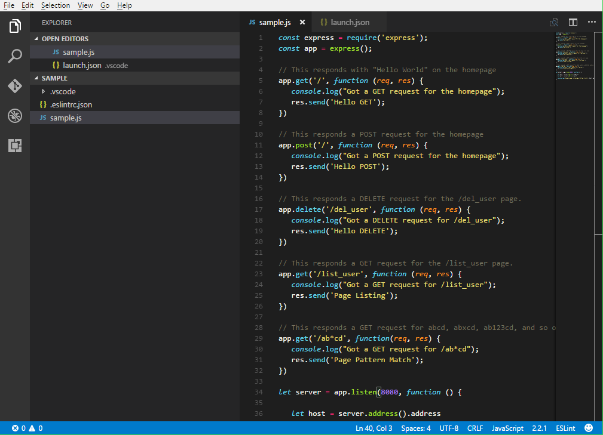

# Monokai Phoenix Theme

[](https://marketplace.visualstudio.com/items?itemName=ZigaGrcar.theme-monokai-phoenix) [](https://github.com/zigagrcar/vscode-monokai-phoenix)

A modern Monokai theme for Visual Studio Code.


## Changelog

Added colors for bracket pair colorization added in the latest release, you can customize it in settings:

```
"editor.bracketPairColorization.enabled": true,
"workbench.colorCustomizations": {
    "editorBracketHighlight.foreground1": "#FD971F"
}
```

## Install

`Ctrl/Command + P` to launch the command palette:

```
ext install theme-monokai-phoenix
```

## Screenshot

NodeJS example code:



## Credits

Based on the theme [Atom Monokai](https://github.com/kevinsawicki/monokai) from [kevinsawicki](https://github.com/kevinsawicki).  
